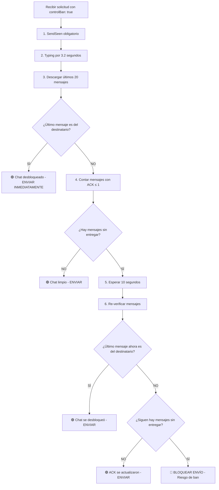

# 🛡️ Sistema de Anti-Baneo y Control de Mensajes - WhatsApp API

## 📖 Índice

1. [Introducción](#introducción)
2. [¿Qué es el Sistema de Anti-Baneo?](#qué-es-el-sistema-de-anti-baneo)
3. [Funcionamiento del Contador de Mensajes](#funcionamiento-del-contador-de-mensajes)
4. [Nuevos Endpoints](#nuevos-endpoints)
5. [Parámetro controlBan](#parámetro-controlban)
6. [Algoritmo de Detección Inteligente](#algoritmo-de-detección-inteligente)
7. [Implementación en Código](#implementación-en-código)
8. [Casos de Uso Prácticos](#casos-de-uso-prácticos)
9. [Troubleshooting](#troubleshooting)

---

## 🎯 Introducción

Este sistema implementa un mecanismo avanzado de **prevención de baneo** para APIs de WhatsApp, combinando:

- **Contador inteligente** de mensajes sin recibir por chat
- **Detección automática** de chats bloqueados/desbloqueados  
- **Comportamiento humano simulado** para evitar detección de bots
- **Verificación del último mensaje** para optimizar velocidad de envío

### Problema que resuelve:

❌ **Sin sistema anti-baneo:**
- Envío masivo sin control → Ban de cuenta
- No hay forma de saber si los mensajes llegan
- Comportamiento obvio de bot
- Pérdida de cuentas valiosas

✅ **Con sistema anti-baneo:**
- Envío inteligente y controlado
- Monitoreo en tiempo real de entrega
- Comportamiento humano simulado
- Protección robusta contra suspensiones

---

## 🛡️ ¿Qué es el Sistema de Anti-Baneo?

### Concepto Base

El sistema **analiza el comportamiento del chat** antes de enviar mensajes, simulando cómo un humano real verificaría si puede enviar un mensaje.

### Estrategia Multi-Capa

1. **📊 Capa de Monitoreo**: Contador de mensajes sin recibir
2. **🔍 Capa de Detección**: Análisis del último mensaje  
3. **⏱️ Capa de Timing**: Simulación de comportamiento humano
4. **🚫 Capa de Prevención**: Bloqueo inteligente de envíos riesgosos

### Indicadores de Riesgo

| Indicador | Riesgo | Acción |
|-----------|--------|---------|
| Último mensaje del destinatario | 🟢 **Bajo** | Envío inmediato |
| Último mensaje nuestro con ACK > 1 | 🟡 **Medio** | Envío con verificación |
| Múltiples mensajes sin ACK | 🟠 **Alto** | Espera y re-verificación |
| Mensajes persistentemente sin ACK | 🔴 **Crítico** | Bloqueo de envío |

---

## 📊 Funcionamiento del Contador de Mensajes

### ¿Qué cuenta el sistema?

El contador rastrea **mensajes enviados por nosotros** (`fromMe: true`) que no han sido confirmados como recibidos.

### Estados de ACK (Acknowledgment)

```
ACK 0: 📤 Mensaje enviado
ACK 1: 🌐 Entregado al servidor WhatsApp  
ACK 2: 📱 Entregado al dispositivo del destinatario
ACK 3: 👁️ Leído por el destinatario
```

### Lógica del Contador

**➕ Incrementa cuando:**
- Se envía un nuevo mensaje (ACK inicial = 0)

**➖ Decrementa cuando:**
- ACK cambia de ≤1 a >1 (mensaje confirmado como recibido)

**🔄 Se mantiene cuando:**
- Envío falla (mensaje realmente no enviado)
- ACK permanece en 0 o 1 (no recibido)

### Ventajas del Enfoque

- **🎯 Precisión**: Solo cuenta mensajes realmente problemáticos
- **⚡ Velocidad**: Cálculo en memoria, sin consultas pesadas
- **🧠 Inteligencia**: Diferencia entre "no enviado" y "no recibido"

---

## 📋 Nuevos Endpoints

### 1. 📈 Consultar Contador Específico

**Endpoint:** `GET /undelivered-count/:chatid`

**Propósito:** Obtener el número de mensajes sin recibir para un chat específico.

#### Parámetros:
- **`number`** (query, requerido): **Token de SmsWhatsApp** del cliente.
- **`chatid`** (path, requerido): ID del chat (ej: `5491112345678@c.us`)

#### Ejemplo de Uso:
```bash
curl "https://mywhatsapp.jca.ec:5433/undelivered-count/5491112345678@c.us?number=TOKEN_SMSWHATSAPP"
```

#### Respuesta:
```json
{
  "status": "success",
  "message": {
    "chatId": "5491112345678@c.us",
    "undeliveredCount": 3
  }
}
```

**💡 Cuándo usar:** Verificar estado de un chat específico antes de enviar campañas.

---

### 2. 📊 Consultar Todos los Contadores

**Endpoint:** `GET /undelivered-count-all`

**Propósito:** Obtener solo los chats que tienen mensajes sin recibir (> 0).

#### Parámetros:
- **`number`** (query, requerido): **Token de SmsWhatsApp** del cliente.

#### Ejemplo de Uso:
```bash
curl "https://mywhatsapp.jca.ec:5433/undelivered-count-all?number=TOKEN_SMSWHATSAPP"
```

#### Respuesta:
```json
{
  "status": "success",
  "message": {
    "number": "5491198765432",
    "undeliveredMessagesByChat": {
      "5491112345678@c.us": 3,
      "5491187654321@c.us": 1,
      "120363043211234567@g.us": 2
    },
    "totalUndelivered": 6,
    "chatsWithUndeliveredMessages": 3
  }
}
```

**💡 Cuándo usar:** 
- Monitoreo general de la salud de entrega
- Identificar chats problemáticos
- Dashboard de estadísticas

---

### 3. 🔄 Reiniciar Contador

**Endpoint:** `POST /reset-undelivered-count/:chatid`

**Propósito:** Reiniciar (poner en 0) el contador de un chat específico.

#### Parámetros:
- **`number`** (query, requerido): **Token de SmsWhatsApp** del cliente.
- **`chatid`** (path, requerido): ID del chat a reiniciar

#### Ejemplo de Uso:
```bash
curl -X POST "https://mywhatsapp.jca.ec:5433/reset-undelivered-count/5491112345678@c.us?number=TOKEN_SMSWHATSAPP"
```

#### Respuesta:
```json
{
  "status": "success",
  "message": "Contador reiniciado para chat 5491112345678@c.us"
}
```

**💡 Cuándo usar:**
- Después de confirmar manualmente que el contacto está activo
- Al resolver problemas de entrega conocidos
- Mantenimiento de contadores

---

## 🛡️ Parámetro controlBan

### ¿Qué es?

El parámetro `controlBan` activa el **sistema de prevención de baneo** en cualquier endpoint de envío.

### Endpoints Compatibles

#### **Chatting.js:**
- `POST /sendmessage/:phone`
- `POST /sendmedia/:phone`  
- `POST /sendlocation/:phone`
- `POST /sendButtons/:chatid`
- `POST /sendList/:chatid`

#### **Group.js:**
- `POST /sendMessageById/:chatid`
- `POST /SendMediaById/:chatid`
- `POST /sendmessage/:chatname`
- `POST /sendmedia/:chatname`
- `POST /sendlocation/:chatname`
- `POST /sendlocationById/:chatid`

### Activación

```json
{
  "message": "Tu mensaje aquí",
  "controlBan": true
}
```

### Comportamientos

| controlBan | Comportamiento |
|------------|----------------|
| `false` o ausente | Envío directo, sin verificaciones adicionales |
| `true` | Activación completa del sistema anti-baneo |

---

## 🧠 Algoritmo de Detección Inteligente

### Flujo Completo del Sistema



### Explicación Detallada

#### **Paso 1: SendSeen Obligatorio**
```javascript
await chat.sendSeen();
```
- **Propósito**: Marcar como leídos los mensajes del chat
- **Efecto**: Comportamiento humano natural
- **Beneficio**: Reduces sospecha de automatización

#### **Paso 2: Typing Simulado (3.2 segundos)**
```javascript
await chat.sendStateTyping();
await sleep(3200);
```
- **Propósito**: Simular que estás escribiendo
- **Timing**: 3.2 segundos (tiempo humano realista)
- **Efecto**: El destinatario ve "escribiendo..."

#### **Paso 3: Análisis del Último Mensaje**
```javascript
const lastMessage = messages[messages.length - 1];
if (!lastMessage.fromMe) {
    // Chat desbloqueado - envío inmediato
}
```

**✅ Lógica del "Chat Desbloqueado":**

Si el último mensaje **NO es tuyo** (`!fromMe`):
- El destinatario **respondió después** de recibir tus mensajes
- **Prueba de que puede recibir** tus mensajes
- **Seguro enviar** → Procede inmediatamente
- **Ahorro de tiempo** → No necesita más verificaciones

#### **Paso 4: Verificación de ACK**
```javascript
const undeliveredMessages = messages.filter(msg => msg.fromMe && msg.ack <= 1);
```
- **Solo si** el último mensaje es tuyo
- **Cuenta mensajes** que no llegaron al dispositivo
- **Determina nivel de riesgo**

#### **Paso 5: Espera Inteligente**
- **10 segundos de pausa** para que ACK se actualicen
- **Nueva descarga** de mensajes
- **Re-verificación** del último mensaje

#### **Paso 6: Decisión Final**
- **Si hay respuesta del destinatario**: Enviar
- **Si ACK se actualizaron**: Enviar  
- **Si persisten problemas**: **BLOQUEAR**

### Optimizaciones de Velocidad

🚀 **Envío ultra-rápido** para chats activos:
- Si último mensaje es del destinatario → **0 segundos de espera**

⏱️ **Envío verificado** para chats inactivos:
- Verificación completa → **~13.2 segundos total**

---

## 💻 Implementación en Código

### Ejemplo 1: Envío Simple con Anti-Baneo

```bash
curl -X POST "https://mywhatsapp.jca.ec:5433/sendmessage/5491112345678?number=TOKEN_SMSWHATSAPP" \
  -H "Content-Type: application/json" \
  -d '{
    "message": "¡Hola! ¿Cómo estás?",
    "controlBan": true
  }'
```

### Ejemplo 2: Envío de Media con Verificación

```bash
curl -X POST "https://mywhatsapp.jca.ec:5433/sendmedia/5491112345678?number=TOKEN_SMSWHATSAPP" \
  -H "Content-Type: application/json" \
  -d '{
    "media": "data:image/jpeg;base64,/9j/4AAQ...",
    "type": "image",
    "caption": "¡Mira esta imagen!",
    "controlBan": true
  }'
```

### Ejemplo 3: Monitoreo Antes de Campaña

```javascript
// 1. Verificar estado general
const response = await fetch('/undelivered-count-all?number=TOKEN_SMSWHATSAPP');
const data = await response.json();

console.log(`Chats con problemas: ${data.message.chatsWithUndeliveredMessages}`);
console.log(`Total mensajes sin entregar: ${data.message.totalUndelivered}`);

// 2. Enviar solo si el chat está limpio
if (data.message.undeliveredMessagesByChat['5491112345678@c.us'] === undefined) {
    // Chat sin problemas, proceder con envío
    await sendMessage({
        message: "Promoción especial...",
        controlBan: true
    });
}
```

### Respuestas del Sistema

#### **✅ Envío Exitoso (Chat Desbloqueado)**
```json
{
  "status": "success",
  "message": "Mensaje enviado exitosamente a 5491112345678@c.us",
  "id": "3EB0C0A5F7E4D2B1C8A9F6E3D5B7A1",
  "undeliveredInThisChat": 0,
  "totalUndelivered": 2
}
```

#### **✅ Envío Exitoso (Después de Verificación)**
```json
{
  "status": "success", 
  "message": "Mensaje enviado exitosamente a 5491112345678@c.us",
  "id": "3EB0C0A5F7E4D2B1C8A9F6E3D5B7A1",
  "undeliveredInThisChat": 1,
  "totalUndelivered": 5
}
```

#### **🚫 Envío Bloqueado (Ban Prevenido)**
```json
{
  "status": "error",
  "message": "No se envía para prevenir ban. Hay 3 mensajes sin recibir en este chat por posible bloqueo.",
  "undeliveredCount": 3,
  "preventedBan": true
}
```

---

## 🎯 Casos de Uso Prácticos

### Caso 1: Marketing Masivo Seguro

```javascript
const contacts = ['549111...', '549222...', '549333...'];

for (const contact of contacts) {
    // Verificar estado antes de enviar
    const status = await checkUndeliveredCount(contact);
    
    if (status.count === 0) {
        await sendMessage({
            phone: contact,
            message: "🎉 ¡Oferta especial solo hoy!",
            controlBan: true
        });
        
        // Pausa entre envíos
        await sleep(5000);
    } else {
        console.log(`Saltando ${contact} - ${status.count} mensajes pendientes`);
    }
}
```

### Caso 2: Servicio al Cliente Inteligente

```javascript
async function respondToCustomer(customerPhone, response) {
    try {
        const result = await sendMessage({
            phone: customerPhone,
            message: response,
            controlBan: true
        });
        
        if (result.preventedBan) {
            // Notificar al agente sobre el problema
            notifyAgent(`Cliente ${customerPhone} posiblemente nos bloqueó`);
            
            // Usar canal alternativo
            await sendEmail(customerPhone, response);
        }
    } catch (error) {
        console.error('Error enviando respuesta:', error);
    }
}
```

### Caso 3: Monitoreo en Dashboard

```javascript
async function getDashboardStats() {
    const allCounts = await fetch('/undelivered-count-all?number=TOKEN_SMSWHATSAPP');
    const data = await allCounts.json();
    
    return {
        totalChatsWithIssues: data.message.chatsWithUndeliveredMessages,
        totalUndeliveredMessages: data.message.totalUndelivered,
        healthScore: calculateHealthScore(data.message),
        alertLevel: getAlertLevel(data.message.totalUndelivered)
    };
}

function calculateHealthScore(data) {
    const total = Object.keys(data.undeliveredMessagesByChat).length;
    const healthy = total === 0 ? 100 : Math.max(0, 100 - (total * 10));
    return healthy;
}
```

### Caso 4: Recuperación Automática

```javascript
async function autoRecovery() {
    const problematicChats = await getProblematicChats();
    
    for (const chat of problematicChats) {
        // Esperar 1 hora
        await sleep(3600000);
        
        // Intentar mensaje de prueba
        const result = await sendMessage({
            phone: chat.id,
            message: "👋",
            controlBan: true
        });
        
        if (result.status === 'success') {
            // Chat recuperado, reiniciar contador
            await resetUndeliveredCount(chat.id);
            console.log(`Chat ${chat.id} recuperado`);
        }
    }
}
```

---

## 🔧 Troubleshooting

### Problema 1: "Muchos chats con mensajes sin entregar"

**Síntomas:**
- `/undelivered-count-all` muestra muchos chats
- Envíos frecuentemente bloqueados

**Soluciones:**
```javascript
// Verificar si es problema real o falso positivo
await Promise.all([
    resetUndeliveredCount('chat1@c.us'),
    resetUndeliveredCount('chat2@c.us'),
    resetUndeliveredCount('chat3@c.us')
]);

// Enviar mensajes de prueba
const testResult = await sendMessage({
    phone: 'chat1@c.us',
    message: 'Prueba de conectividad',
    controlBan: true
});
```

### Problema 2: "Sistema muy lento"

**Síntomas:**
- Envíos tardan más de 15 segundos
- Timeout en peticiones

**Soluciones:**
```javascript
// Usar envío sin control para mensajes urgentes
await sendMessage({
    phone: '549111222333@c.us',
    message: 'Mensaje urgente',
    controlBan: false  // Desactivar temporalmente
});

// O verificar estado primero
const count = await getUndeliveredCount('549111222333@c.us');
if (count === 0) {
    // Envío rápido sin verificaciones
    await sendMessage({
        phone: '549111222333@c.us',
        message: 'Mensaje rápido',
        controlBan: false
    });
}
```

### Problema 3: "Falsos positivos de bloqueo"

**Síntomas:**
- Chats que sabemos que funcionan se marcan como bloqueados
- Contactos activos aparecen como problemáticos

**Soluciones:**
```javascript
// Verificación manual
const messages = await fetchMessages('chat@c.us', 10);
const lastMessage = messages[messages.length - 1];

if (!lastMessage.fromMe) {
    // Chat definitivamente activo, reiniciar contador
    await resetUndeliveredCount('chat@c.us');
}

// Configurar lista blanca de chats VIP
const vipChats = ['cliente-importante@c.us', 'socio@c.us'];

async function sendToVip(chatId, message) {
    if (vipChats.includes(chatId)) {
        // Saltear control de ban para VIPs
        return await sendMessage({
            phone: chatId,
            message: message,
            controlBan: false
        });
    }
    
    return await sendMessage({
        phone: chatId,
        message: message,
        controlBan: true
    });
}
```

### Problema 4: "Contadores no se actualizan"

**Síntomas:**
- ACK cambian pero contadores permanecen altos
- Eventos de ACK no se procesan

**Diagnóstico:**
```javascript
// Verificar que messageAck.js esté funcionando
console.log('Tracker de mensajes:', global.WWSClient.messageTracker);

// Verificar eventos de ACK manualmente
client.on('message_ack', (msg, ack) => {
    console.log(`Mensaje ${msg.id._serialized}: ACK ${ack}`);
});
```

**Solución:**
```javascript
// Limpieza manual de contadores problemáticos
async function cleanupCounters() {
    const allCounts = await getAllUndeliveredMessagesCount();
    
    for (const [chatId, count] of Object.entries(allCounts)) {
        if (count > 10) {
            // Investigar chat con muchos mensajes pendientes
            console.log(`Investigando chat ${chatId} con ${count} mensajes`);
            
            // Opcionalmente resetear
            await resetUndeliveredCount(chatId);
        }
    }
}
```

---

## 🏆 Mejores Prácticas

### 1. **Monitoreo Continuo**
```javascript
// Ejecutar cada 30 minutos
setInterval(async () => {
    const stats = await getDashboardStats();
    if (stats.alertLevel === 'HIGH') {
        notifyAdmin('Sistema de mensajería requiere atención');
    }
}, 30 * 60 * 1000);
```

### 2. **Envío Escalonado**
```javascript
// Pausa entre envíos masivos
for (const contact of contacts) {
    await sendMessage({...});
    await sleep(randomBetween(3000, 7000)); // 3-7 segundos aleatorios
}
```

### 3. **Recuperación Gradual**
```javascript
// No reiniciar todos los contadores de una vez
async function gradualRecovery() {
    const problematic = await getProblematicChats();
    const batch = problematic.slice(0, 5); // Solo 5 a la vez
    
    for (const chat of batch) {
        await resetUndeliveredCount(chat.id);
        await sleep(60000); // 1 minuto entre reinicios
    }
}
```

### 4. **Logging Detallado**
```javascript
// Mantener logs de decisiones del sistema
function logBanPreventionDecision(chatId, reason, action) {
    console.log(`[${new Date().toISOString()}] Chat: ${chatId}, Razón: ${reason}, Acción: ${action}`);
    
    // Opcional: guardar en archivo o base de datos
    saveToLog({
        timestamp: new Date(),
        chatId,
        reason,
        action,
        systemHealth: calculateSystemHealth()
    });
}
```

---

Este sistema de anti-baneo proporciona una protección robusta mientras mantiene la funcionalidad de envío eficiente. La clave está en encontrar el equilibrio entre **seguridad** y **velocidad** según las necesidades específicas de cada caso de uso. 
